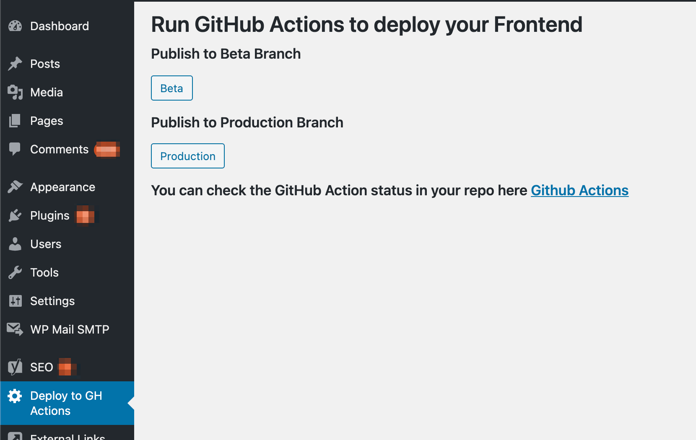

# Deploy to GitHub Actions

Tested up to v5.6.1

## Deploy to GitHub Actions description

A WordPress Plugin to push new pages or updates from your headless Wordpress CMS to a Frontend, such as a Gatsby App on AWS via GitHub Actions.

## Prerequisites

* Your WordPress CMS has already been connected to your Gatsby App. If not, this [Youtube video](https://www.youtube.com/watch?v=DH7I1xRrbxs) will help you get started.
* Your Gatsby App has been successfully deployed to AWS/S3 using Github Actions. (If not you can check out this [Blog Post](https://dev.to/ara225/how-to-host-a-static-website-on-aws-with-https-and-ci-cd-33of?signin=true) by Anna Aitchison) At this time, Github does not provide a re-run button for Github Actions. I have written a concise tutorial on [how to run GitHub Actions manually using Postman client](https://medium.com/@christinavhastenrath/how-to-run-github-actions-manually-afebbe77d325).

## The Workflow

Here is what you need to do in order to get this plugin to work

* Create a folder containing one PHP file
* Hook into WordPress actions to create admin dashboard menu item
* Create a button with onClick to POST to GitHub Actions API to re-publish the Gatsby App to AWS/S3
* Create a personal token in GitHub to use for GitHub Actions API authorization
* Create zip file of plugin folder, upload to wordpress and activate

## How to install the plugin

* Download the plugin and insert your details into the code. You can do so with Vim or by opening up the php file in a code editor such as VSCode
* Log into your Wordpress and navigate to 'Add new plugin'
* Upload the folder and activate the plugin

For all steps on how to setup a Wordpress/GitHub Action integration with this plugin please follow my [Twilio Tutorial](https://www.twilio.com/blog/create-wordpress-plugin-rebuild-gatsby-app-aws-github-actions)

## Screenshots

This is the admin page of the 'Deploy to GitHub Actions' plugin. You can add/delete buttons to deploy to your GitHub branches if you wish. Please remember to download the plugin and insert your GitHub details before zipping it back up and uploading the plugin.

